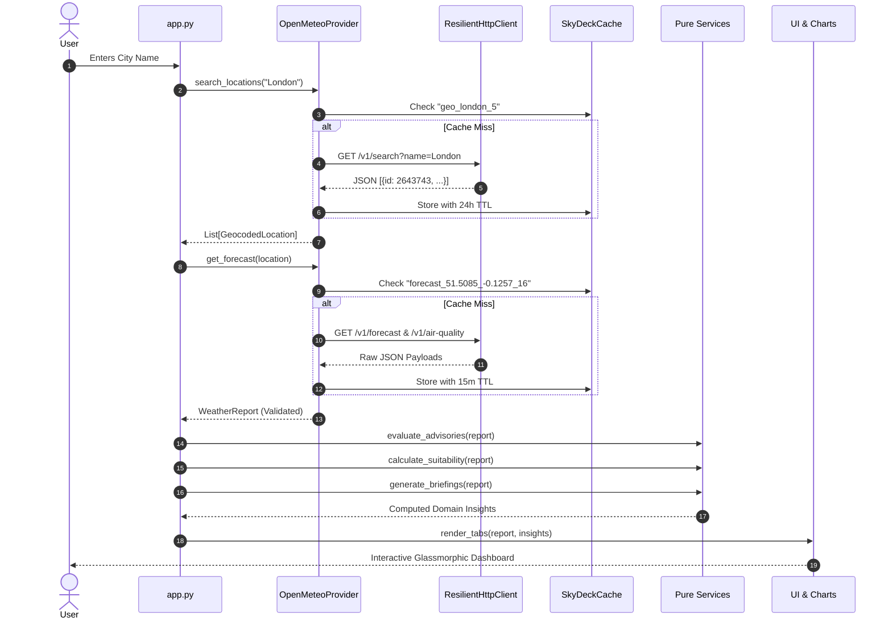

# SkyDeck — System Architecture & Design Specification

This document provides a technical deep-dive into SkyDeck's architecture, data flows, and engineering principles.

---

## 1. Architectural Style: Layered Domain-Driven Design (DDD)

SkyDeck follows a clean, 5-tier layered architecture with strict dependency boundaries:

```
┌─────────────────────────────────────────────────────────────┐
│                       UI Layer (src/skydeck/ui/)            │
│       theme.py  |  components.py  |  charts.py  |  tabs.py  │
└──────────────────────────────┬──────────────────────────────┘
                               │ imports
                               ▼
┌─────────────────────────────────────────────────────────────┐
│                 Services Layer (src/skydeck/services/)      │
│  advisories.py  |  suitability.py  |  briefing.py  | compare │
└──────────────────────────────┬──────────────────────────────┘
                               │ imports
                               ▼
┌─────────────────────────────────────────────────────────────┐
│                  Domain Layer (src/skydeck/domain/)         │
│         models.py  |  units.py  |  weather_codes.py         │
└──────────────────────────────┬──────────────────────────────┘
                               ▲
                               │ implements & uses
┌──────────────────────────────┴──────────────────────────────┐
│                Providers Layer (src/skydeck/providers/)     │
│        base.py  |  open_meteo.py  |  demo_provider.py       │
└──────────────────────────────┬──────────────────────────────┘
                               │ uses
                               ▼
┌─────────────────────────────────────────────────────────────┐
│                   Core Layer (src/skydeck/core/)            │
│   http_client.py  |  cache.py  |  errors.py  | diagnostics  │
└──────────────────────────────▲──────────────────────────────┘
                               │ loads
┌──────────────────────────────┴──────────────────────────────┐
│                 Config Layer (config/settings.py)           │
└─────────────────────────────────────────────────────────────┘
```

### Dependency Invariant
- **Lower layers never import higher layers.**
- `services` never imports `ui` or `providers`.
- `domain` has zero dependencies on `services`, `providers`, or `ui`.
- `core` has zero dependencies on `domain` or `services`.
- Pure business logic in `services/` contains **no network calls** and **no Streamlit calls**.

---

## 2. Component Responsibilities

| Layer | Module | Responsibility |
|---|---|---|
| **Entrypoint** | `app.py` | Streamlit session setup, sidebar routing, exception boundary. |
| **Config** | `config/settings.py` | Endpoints, timeouts, TTLs, advisory thresholds, weights. |
| **Core** | `errors.py` | Hierarchical custom exceptions with `.to_user_message()`. |
| | `http_client.py` | Network executor with exponential backoff & rate-limit handling. |
| | `cache.py` | In-memory TTL cache with stale-while-revalidate capability. |
| | `diagnostics.py` | Telemetry tracker for calls, hit ratio, and quota usage. |
| **Domain** | `models.py` | Pydantic v2 data models with null-safe default fields. |
| | `units.py` | Bidirectional conversions and safe formatting (`"—"` for nulls). |
| | `weather_codes.py` | WMO code lookup table, icons, and thunderstorm flags. |
| **Providers** | `base.py` | Abstract interface `BaseWeatherProvider`. |
| | `open_meteo.py` | Live REST client integrating caching and stale fallback. |
| | `demo_provider.py` | Zero-network provider reading `sample_data/` JSON files. |
| **Services** | `advisories.py` | Rule-based evaluation of heat, freeze, wind, storm, UV, AQI. |
| | `suitability.py` | 0–100 activity suitability formulas with thunderstorm override. |
| | `briefing.py` | Natural-language weather synthesis for Today & Tomorrow. |
| | `compare.py` | Multi-city benchmarking and ranking. |
| **Storage** | `saved_cities.py` | Bookmark management and session state persistence in JSON. |
| **UI** | `theme.py` | Glassmorphic CSS styling and modern typography. |
| | `components.py` | Header strip, hero card, metric cards, callouts. |
| | `charts.py` | 6 hardware-accelerated Plotly visualizations. |
| | `tabs.py` | Tab view builders (Overview, Forecast, AQ, Activities, Compare, Diag). |

---

## 3. Data Pipeline & Flow



---

## 4. Resilience & Error Boundaries

1. **Zero Raw Tracebacks:** All code execution in `app.py` is wrapped in an explicit exception boundary:
   ```python
   try:
       report = provider.get_forecast(...)
   except SkyDeckError as err:
       st.error(err.to_user_message())
   ```
2. **Stale Cache Fallback:** If network connectivity drops while a user attempts to refresh, `OpenMeteoProvider` catches the network error, queries `SkyDeckCache.get(key, allow_stale=True)`, and returns the expired report tagged with `DataSourceStatus.STALE_FALLBACK` and an orange banner.
3. **Offline Demo Mode:** If all internet access is severed, the user can toggle "Offline Demo Mode" in the sidebar, which delegates to `DemoWeatherProvider` and guarantees 100% functionality without network access.
